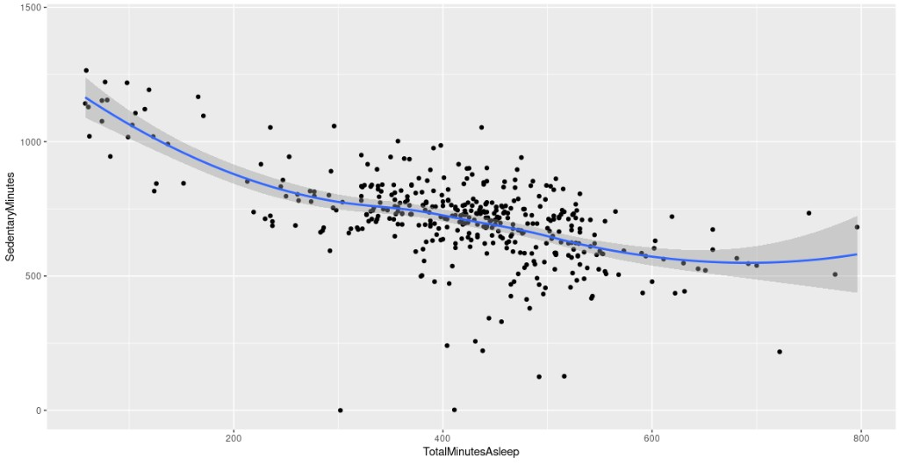
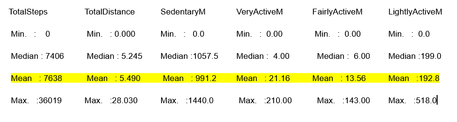
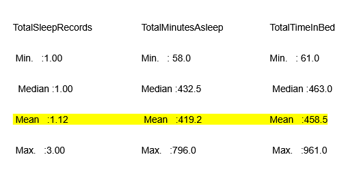
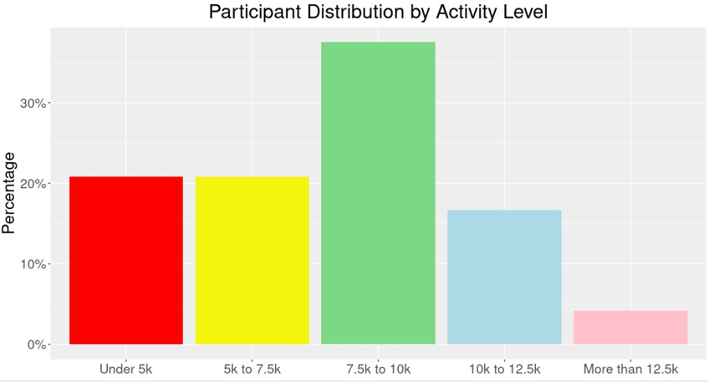
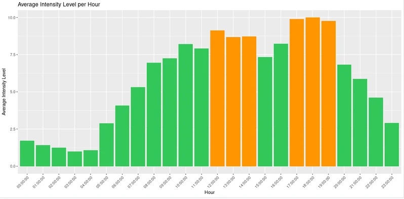
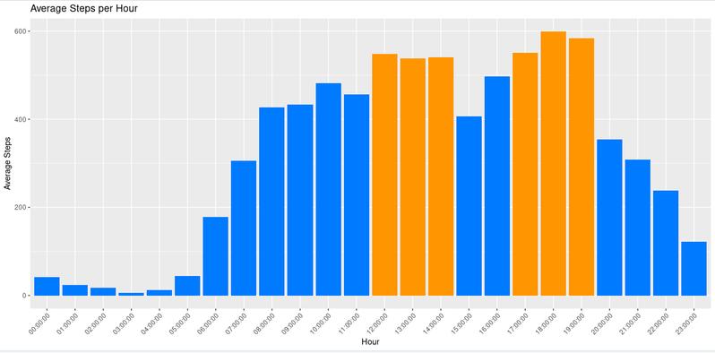
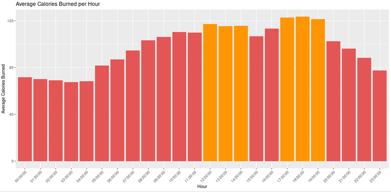
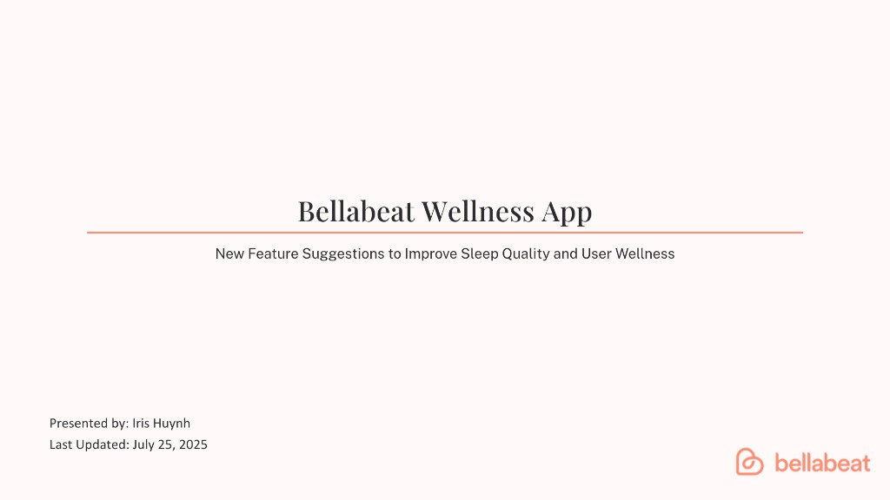

# 📊 Bellabeat Case Study — Smart Device Usage Analysis

Hands-on **end-to-end data analytics** project in **R**: reproducible cleaning and joins on Fitbit exports, KPIs and exploratory analysis (activity, sleep, hourly usage), correlation and distribution checks, and **stakeholder-ready recommendations** for Bellabeat’s app and marketing strategy (women-focused digital health).

### The six-step data analysis process

The case study follows the **six-step data analysis process** used in the Google Data Analytics program:

| # | Phase | What this repo covers |
|:---:|:---|:---|
| **1** | **Ask** | Business task, questions, stakeholders |
| **2** | **Prepare** | Data source, scope, what’s in / out of git |
| **3** | **Process** | Cleaning, joins, standardized tables (`clean.R`) |
| **4** | **Analyze** | KPI checks, visuals and narrative (`analysis.R`) |
| **5** | **Share** | Canva slides, reproducible R commands, figures |
| **6** | **Act** | Product + marketing recommendations, next data steps |

Below, each step has its **own section** (**1**–**6**) in the same order.

---

## 🔗 Quick links

| 🔎 | Resource |
|---|----------|
| 🎬 | **[Presentation slides (Canva)](https://canva.link/emsulvwxmh7dtii)** — interactive deck |
| 📑 | Slide deck PDF in repo: [`presentation/bellabeat_presentation.pdf`](presentation/bellabeat_presentation.pdf) |
| 📘 | Course case brief: [`bellabeat_case_study.pdf`](bellabeat_case_study.pdf) |

If the Canva link asks for permission, open the design in Canva → **Share → Anyone with the link → View**.

---

## 1. Ask

### 💼 Business task
Understand **trends in non-Bellabeat smart-device usage** (activity, sleep, time of day) and recommend how Bellabeat — especially the **Bellabeat app** — could apply those insights to features and marketing.

### 🤔 Guiding questions
- What trends appear in how people move, rest, and burn energy?
- How could those trends map to Bellabeat customers?
- How could marketing and product prioritize **sleep quality** and **daily movement**?

### 👥 Stakeholders
Marketing analytics and leadership evaluating growth and positioning — context in the **[Bellabeat case study brief (PDF)](bellabeat_case_study.pdf)**.

---

## 2. Prepare

### 📂 Data source
- **Fitbit Fitness Tracker Data** (Kaggle; **CC0** public domain).
- Small convenience sample (~30 consenting users); **not** nationally representative — treat conclusions as directional, not definitive.

### 🗂️ What is in this repository
| Location | Purpose |
|----------|---------|
| `dataset/cleaned_data/*.csv` | Cleaned, analysis-ready tables and summaries |
| `dataset/README.md` | Data conventions and refresh steps |
| `analysis/clean.R` | Load → dedupe → standardize dates → merge → write cleaned CSVs |
| `analysis/analysis.R` | KPI summary, exploratory ggplot, hourly pattern CSV |
| `assets/dashboard/*.png` | Auto-generated exploration plot from `analysis.R` |
| `assets/findings/*.png` | Figures exported for README findings (same variables as your analysis charts) |

### 🚫 What is *not* committed (by design)
- **`dataset/Raw Data/`** — add Kaggle CSVs locally after clone, then run `clean.R`.
- **Legacy Fitabase date-range folders** — excluded from this workflow (see `.gitignore`).

---

## 3. Process

High-level steps in [`analysis/clean.R`](analysis/clean.R):
- Remove duplicate rows.
- Parse activity and sleep dates consistently; split hourly timestamps into **date** + **time-of-day** for steps, intensity, and calories.
- Build **`dailySleepActivity_merged_cleaned.csv`**: inner join of sleep and daily activity on `Id` + `date`.
- Write hourly long-form tables for charts and further visualization.

Below: **code → output** from the same Fitbit CSVs you use locally (`dataset/Raw Data`). Outputs may differ slightly if file versions change.

### Inspect raw inputs

```r
library(readr)

raw_dir <- "dataset/Raw Data"
activity <- read_csv(file.path(raw_dir, "dailyActivity_merged.csv"), show_col_types = FALSE)

colnames(activity)
head(activity, 3)
```

```
 [1] "Id"                       "ActivityDate"
 [3] "TotalSteps"               "TotalDistance"
 [5] "TrackerDistance"          "LoggedActivitiesDistance"
 [7] "VeryActiveDistance"       "ModeratelyActiveDistance"
 [9] "LightActiveDistance"      "SedentaryActiveDistance"
[11] "VeryActiveMinutes"        "FairlyActiveMinutes"
[13] "LightlyActiveMinutes"     "SedentaryMinutes"
[15] "Calories"

# A tibble: 3 × 15
          Id ActivityDate TotalSteps TotalDistance TrackerDistance
       <dbl> <chr>             <dbl>         <dbl>           <dbl>
1 1503960366 4/12/2016         13162          8.5             8.5
2 1503960366 4/13/2016         10735          6.97            6.97
3 1503960366 4/14/2016         10460          6.74            6.74
# ℹ 10 more variables …
```

```r
library(dplyr)
n_distinct(activity$Id)
```

```
[1] 33
```

### Clean dates and merge sleep + daily activity

Paths match [`analysis/clean.R`](analysis/clean.R): `dataset/Raw Data` → reads; `dataset/cleaned_data` → writes.

```r
library(dplyr); library(lubridate); library(readr)

raw_dir <- "dataset/Raw Data"

activity <- read_csv(file.path(raw_dir, "dailyActivity_merged.csv"), show_col_types = FALSE)
activity <- distinct(activity) %>%
  mutate(date = mdy(ActivityDate)) %>%
  select(-ActivityDate)

sleep_day <- read_csv(file.path(raw_dir, "sleepDay_merged.csv"), show_col_types = FALSE)
sleep_day <- distinct(sleep_day) %>%
  mutate(date = as.Date(mdy_hms(SleepDay))) %>%
  select(-SleepDay)

daily_merge <- sleep_day %>%
  inner_join(activity, by = c("Id", "date"))

nrow(activity); nrow(sleep_day); nrow(daily_merge)
head(daily_merge, 3)
```

```
[1] 940
[1] 410
[1] 410

# A tibble: 3 × 18
          Id TotalSleepRecords TotalMinutesAsleep TotalTimeInBed date
       <dbl>             <dbl>              <dbl>          <dbl> <date>
1 1503960366                 1                327            346 2016-04-12
2 1503960366                 2                384            407 2016-04-13
3 1503960366                 1                412            442 2016-04-15
# ℹ 13 more variables: TotalSteps <dbl>, TotalDistance <dbl>, …
```

```r
clean_dir <- "dataset/cleaned_data"
write_csv(daily_merge, file.path(clean_dir, "dailySleepActivity_merged_cleaned.csv"))
```

Weight logs are retained in cleaned form but are **sparse** (few users); primary story uses activity + sleep.

---

## 4. Analyze

Findings below combine **patterns in this Fitbit sample** (cleaned in [`clean.R`](analysis/clean.R), summarized in [`analysis.R`](analysis/analysis.R)) with **public-health context** where it helps interpret step and sleep levels.

### 1. Sedentary minutes vs minutes asleep

For most people in this sample, **nightly sleep falls in about 5–9 hours** (roughly **300–540 minutes**). On the scatter plot, **sedentary minutes and minutes asleep move in opposite directions**—a **negative correlation**: days with **more** time asleep tend to show **less** sedentary time, and vice versa.

In this analysis, among people logging **more than 16 sedentary hours per day** (**960 minutes**), **about 75%** also report **under 3 hours asleep** (**180 minutes**) that night—suggesting that **heavy sedentary days** often coincide with **very short sleep**. **More active** patterns in the data line up with **better-reported sleep** on the same calendar day.

**Takeaway:** **Lower daily movement and very high sedentary time align with shorter, harder nights of sleep** in this sample—useful for thinking about breaking up sitting time and protecting sleep.



---

### 2. Daily activity & sleep summaries

Summaries across **daily activity** and **daily sleep** rows give a baseline before merging days that have both measures.

Population research often cites **roughly 8,000–10,000 steps per day** as a practical activity target; work summarized by the **National Institutes of Health** and related studies ties **higher step counts** to better health outcomes—for example, research has associated **about 8,000 steps/day** with a **much lower risk of dying from any cause** versus lower counts, and **about 12,000 steps/day** with an **even larger reduction in risk** (exact figures vary by study and population). In **this** dataset, the **mean daily steps sit below** that ballpark **“recommended” range**, so the sample skews toward **less movement** than those benchmarks.

**Sedentary time is very high on average**: about **991 minutes** per day in the daily activity table—roughly **16.5 hours**, or about **two-thirds of the day** spent sedentary.

**Sleep:** Mean time asleep in the sleep table is **about 7 hours** (**~420 minutes**) per night on average—close to common **7-hour** guidelines, with distribution spread above and below that.





---

### 3. Participant distribution by step bands

When each **participant** is placed in a bucket by **mean daily steps**, **about 40%** fall **under 7,500 steps/day**—**below** the rough **7,500–10,000 steps/day** band often discussed in **NIH-aligned** guidance. **More than a third** land in the **7,500–10,000 steps/day** range.

**Takeaway:** **Most participants are at least moderately active** (middle bands add up), but a **large minority** sits **under the common 7,500-step** benchmark—worth addressing with realistic nudges and progressive goals.



---

### 4. Hourly intensity, steps, and calories

Hourly averages (after parsing clock time in [`clean.R`](analysis/clean.R)) show **when** this sample moves and burns energy. **Highest average steps** line up with **noon–2 PM** and **5–7 PM**. **Peak average intensity** follows the **same windows** (**12 PM–2 PM** and **5 PM–7 PM**). **Calorie burn per hour** is **highest around midday** and again in the **early evening (roughly 5–7 PM)**, matching mealtimes, commutes, or planned exercise for many people.

That pattern supports **timing nudges** (hydration, movement breaks, or workouts) when users are already more active—not only overnight, when averages are flat.







---

### Merged user-days KPI roll-up (`analysis.R` only)
These apply to **[`dailySleepActivity_merged_cleaned.csv`](dataset/cleaned_data/dailySleepActivity_merged_cleaned.csv)** (days with **both** sleep and activity):

| Metric | Value |
|--------|--------|
| Mean daily steps | **~8,515** |
| Mean minutes asleep / night | **~419** (~7.0 h) |
| Mean sedentary minutes / day | **~712** (~11.9 h) |
| Share of merged user-days with &lt; 7,500 steps | **~41%** |
| Share of merged user-days with &lt; 7 h sleep | **~44%** |

Source: [`dataset/cleaned_data/kpi_summary.csv`](dataset/cleaned_data/kpi_summary.csv).

### 📎 Supporting outputs
- [`dataset/cleaned_data/hourly_pattern_summary.csv`](dataset/cleaned_data/hourly_pattern_summary.csv)
- [`dataset/cleaned_data/kpi_summary.csv`](dataset/cleaned_data/kpi_summary.csv)

---

## 5. Share

### 🎬 Presentation
- **[Bellabeat Presentation](presentation/bellabeat_presentation.pdf)**



### 🔁 How to reproduce figures and tables
From the project root (with R packages installed, e.g. `dplyr`, `tidyr`, `lubridate`, `readr`, `ggplot2`):

```bash
Rscript analysis/clean.R
Rscript analysis/analysis.R
```

---

## 6. Act

Recommendations below follow the **findings in §4** (segment, features, and channels).

### 📱 Product and experience (Bellabeat app–oriented)
- **Audience:** people who care about **sleep quality** and sustainable daily movement.
- **Sleep:** wind-down content (e.g. short meditation or light stretching before bed); consider richer **sleep insight** in-app when data allows (duration breakdown, consistency).
- **Movement:** **streaks / rewards** for hitting step goals; **mid-day nudges** aligned with low activity during typical work hours and peaks around lunch and early evening.
- **Sedentary breaks:** gentle prompts after long inactive stretches.

### 📣 Marketing
- Emphasize **sleep + energy** and realistic activity goals (not only “10k steps”).
- **Short-form social** (e.g. TikTok) and **creator partnerships** in the fitness/wellness space.

### 🔭 Next data steps
- Larger, more representative sample; Bellabeat first-party app data where available; longer time windows to validate seasonality.

---

## 🛠️ Tools
- **R**: `dplyr`, `tidyr`, `lubridate`, `readr`, `ggplot2`
- **Docs**: course case brief (PDF), presentation PDF + **Canva** slides

---

## ⚖️ License and attribution
- Fitbit Fitness Tracker Data is used here under **CC0** as described on Kaggle and in course materials.
- Bellabeat is a trademark of its owner; this is an **educational case study**, not affiliated with Bellabeat.
