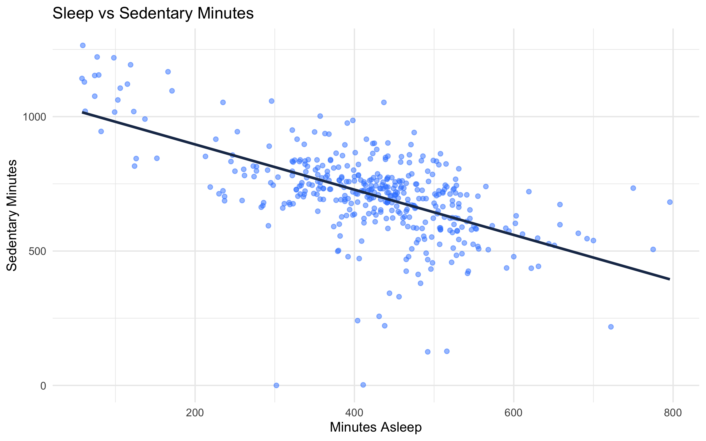
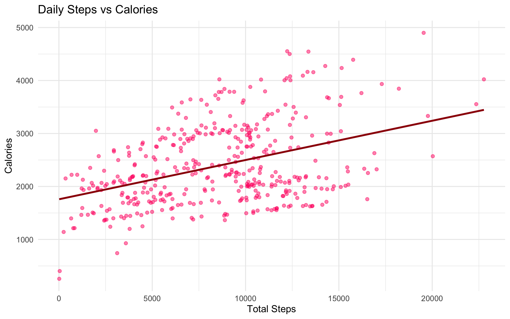

# 📊 Bellabeat Case Study — Smart Device Usage Analysis

Capstone-style analysis of Fitbit tracker data to infer how people use smart wellness devices, then translate patterns into **product and marketing ideas** for Bellabeat (women-focused health tech).

### The six-step data analysis process

The case study follows the **six-step data analysis process** used in the Google Data Analytics program:

| # | Phase | What this repo covers |
|:---:|:---|:---|
| **1** | **Ask** | Business task, questions, stakeholders |
| **2** | **Prepare** | Data source, scope, what’s in / out of git |
| **3** | **Process** | Cleaning, joins, standardized tables (`clean.R`) |
| **4** | **Analyze** | KPIs, relationships, plots (`analysis.R`) |
| **5** | **Share** | Canva slides, reproducible R commands, figures |
| **6** | **Act** | Product + marketing recommendations, next data steps |

Below, each step has its **own section** (**1**–**6**) in the same order.

---

## 🔗 Quick links

| 🔎 | Resource |
|---|----------|
| 🎬 | **[Presentation slides (Canva)](https://www.canva.com/design/DAGtQtIsU_k/Q5YAOl_27URjghjLFTp5qg/view)** — interactive deck |
| 📑 | Slide deck PDF in repo: `presentation/bellabeat_presentation.pdf` |
| 📘 | Course case brief: `bellabeat_case_study.pdf` |

If the Canva link asks for permission, open the design in Canva → **Share → Anyone with the link → View**.

---

## 1. Ask

### 💼 Business task
Understand **trends in non-Bellabeat smart-device usage** (activity, sleep, time of day) and recommend how Bellabeat — especially the **Bellabeat app** — could apply those insights to features and marketing.

### 🤔 Guiding questions
- What trends appear in how people move, rest, and burn energy?
- How could those trends map to Bellabeat customers?
- How could marketing and product prioritize **sleep quality** and **daily movement**?

### 👥 Stakeholders
Marketing analytics and leadership evaluating growth and positioning (see `bellabeat_case_study.pdf`).

---

## 2. Prepare

### 📂 Data source
- **Fitbit Fitness Tracker Data** (Kaggle; **CC0** public domain).
- Small convenience sample (~30 consenting users); **not** nationally representative — treat conclusions as directional, not definitive.

### 🗂️ What is in this repository
| Location | Purpose |
|----------|---------|
| `dataset/cleaned_data/*.csv` | Cleaned, analysis-ready tables and summaries |
| `dataset/README.md` | Data conventions and refresh steps |
| `analysis/clean.R` | Load → dedupe → standardize dates → merge → write cleaned CSVs |
| `analysis/analysis.R` | KPIs, plots, hourly pattern summary |
| `assets/dashboard/*.png` | Exported charts for this narrative |

### 🚫 What is *not* committed (by design)
- **`dataset/Raw Data/`** — add Kaggle CSVs locally after clone, then run `clean.R`.
- **Legacy Fitabase date-range folders** — excluded from this workflow (see `.gitignore`).

---

## 3. Process

High-level steps in `analysis/clean.R`:
- Remove duplicate rows.
- Parse activity and sleep dates consistently; split hourly timestamps into **date** + **time-of-day** for steps, intensity, and calories.
- Build **`dailySleepActivity_merged_cleaned.csv`**: inner join of sleep and daily activity on `Id` + `date`.
- Write hourly long-form tables for charts and further visualization.

Weight logs are retained in cleaned form but are **sparse** (few users); primary story uses activity + sleep.

---

## 4. Analyze

### 📌 Snapshot KPIs (from `kpi_summary.csv`)
| Metric | Value |
|--------|--------|
| Mean daily steps | **~8,515** |
| Mean minutes asleep / night | **~419** (~7.0 h) |
| Mean sedentary minutes / day | **~712** (~11.9 h) |
| Share of user-days with &lt; 7,500 steps | **~41%** |
| Share of user-days with &lt; 7 h sleep | **~44%** |

These support a consistent story: many days fall **below** common step and sleep targets, alongside **high sedentary time** — relevant for wellness positioning.

### 🔍 Key relationships (exploratory)
- **Sleep vs sedentary**: negative association — more sedentary time tends to align with less sleep on a given day (plot below).
- **Steps vs calories**: positive association — more movement aligns with higher energy expenditure.





### 📎 Supporting outputs
- `dataset/cleaned_data/hourly_pattern_summary.csv` — average steps, intensity, and calories by clock time (“when are people most active?”).
- **`presentation/bellabeat_presentation.pdf`** — PDF slides; see also the **[Canva presentation](https://www.canva.com/design/DAGtQtIsU_k/Q5YAOl_27URjghjLFTp5qg/view)** above.

---

## 5. Share

### 🎬 Presentation
- **[Open slides on Canva](https://www.canva.com/design/DAGtQtIsU_k/Q5YAOl_27URjghjLFTp5qg/view)** (same design as your deck; use **Share → Anyone with the link** in Canva if viewers can’t open it).

### 🔁 How to reproduce figures and tables
From the project root (with R packages installed, e.g. `dplyr`, `tidyr`, `lubridate`, `readr`, `ggplot2`):

```bash
Rscript analysis/clean.R
Rscript analysis/analysis.R
```

---

## 6. Act

### 📱 Product and experience (Bellabeat app–oriented)
- **Sleep**: education and gentle nudges around consistent bed/wind-down routines; optional deeper sleep breakdown if device data supports it.
- **Movement**: streaks, micro-goals, and **mid-day** prompts — hourly summaries suggest peaks around lunch and early evening; low activity during typical work hours is a design opportunity.
- **Sedentary awareness**: short movement breaks after long still periods (aligned with tracker nudges in the case narrative).

### 📣 Marketing
- Lead with **sleep + energy** and **realistic daily movement** (not only “10k steps”).
- Social proof and short-form content (e.g. TikTok/Instagram) around **wind-down routines** and **desk-break** habits, consistent with the slide recommendations.

### 🔭 Next data steps
- Larger, more representative sample; Bellabeat first-party app data where available; longer time windows to validate seasonality.

---

## About me

I’m **Iris Huynh**, a data analytics learner focused on **turning behavioral and health-related data into clear, actionable stories** for product and marketing decisions. This repository is my **Google Data Analytics capstone** (Bellabeat case study): data prep and analysis in **R**, structured around the **Ask → Act** process, with a **Canva** deck for stakeholders.

- **Focus areas:** data cleaning, exploratory analysis, visualization, and communication of recommendations.  
- **This project:** Fitbit-based smart-device usage patterns, sleep and activity insights, and ideas for the Bellabeat app and go-to-market story.  
- **Connect:** [GitHub profile](https://github.com/irishuynh23). Add your LinkedIn, portfolio, or email on this line when you’re ready.

---

## 🛠️ Tools
- **R**: `dplyr`, `tidyr`, `lubridate`, `readr`, `ggplot2`
- **Docs**: PDF case brief, DOCX research notes, PDF + **Canva** slides

---

## ⚖️ License and attribution
- Fitbit Fitness Tracker Data is used here under **CC0** as described on Kaggle and in course materials.
- Bellabeat is a trademark of its owner; this is an **educational case study**, not affiliated with Bellabeat.
